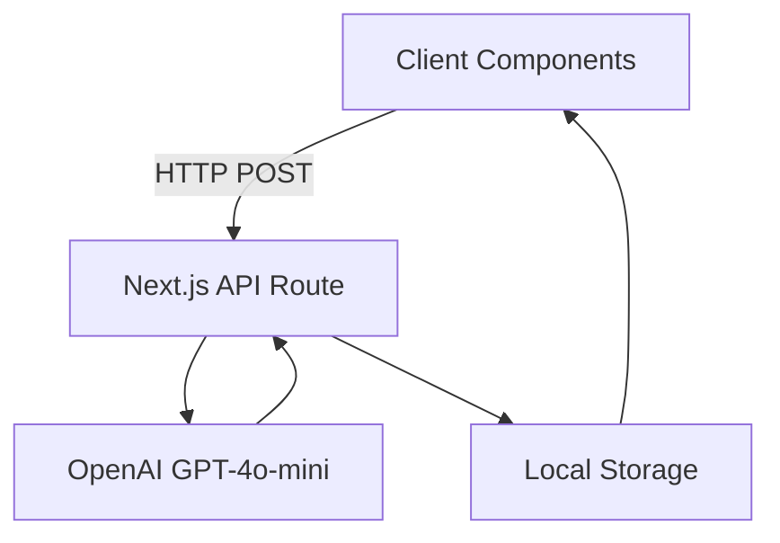
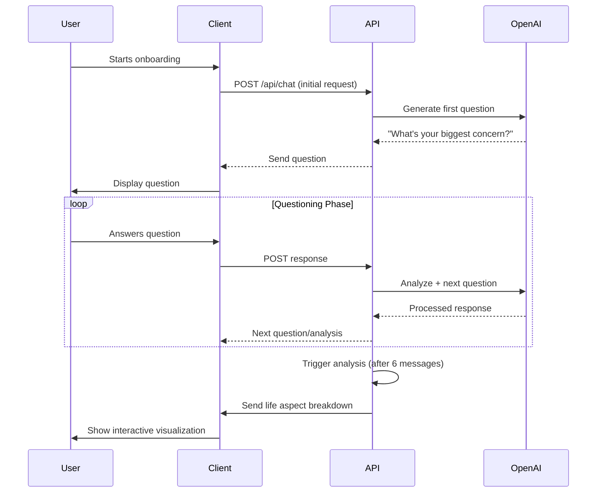

# Talk to Your Future Self


> Hey again, I'm half-asleep. Good luck debugging!

## 🚀 Quick Start

1. **Clone and Navigate**
   ```bash
   git clone https://github.com/yourusername/TTYSF.git
   cd TTYSF
   ```

2. **Set Environment Variables**
   Create a `.env.local` file:
   ```
   OPENAI_API_KEY=sk-your-key
   ```

3. **Install Dependencies**
   ```bash
   npm install
   ```

4. **Run Development Server**
   ```bash
   npm run dev
   ```

## 🔑 OpenAI API Setup

1. [Create API Key](https://platform.openai.com/api-keys)
2. Add to `.env.local`:
   ```
   OPENAI_API_KEY=sk-abc123...paste_key_here
   ```

## 📋 Available Commands

- `npm run dev`: Start development server
- `npm run build`: Create production build
- `npm run start`: Run production server
- `npm run lint`: Run linter

## 🚀 Deployment

[](https://vercel.com/new/clone?repository-url=https%3A%2F%2Fgithub.com%2Fyourusername%2FTTYSF)

## 🛠 Tech Stack

- Next.js
- OpenAI GPT-4o-mini
- tailwindcss

## 🧠 System Architecture




## Conversation Workflow & Life Analysis Flow



Stage 1: Initial Onboarding
Components:

/onboarding page

LocalStorage for user data

Flow:

User provides:

```ts
interface UserData {
  name: string
  age: number
  occupation: string
  lifeGoals: string
  financialLiteracyDetails: string
  // ...baby-related fields
}
```

Data stored in localStorage

Initializes chat state:

```ts
const initialChatState: ChatState = {
  stage: "initial",
  questionIndex: 0,
  chatCount: 0
}
```
Stage 2: Questioning Phase
Predefined Questions:

```ts
const predefinedQuestions = [
  "What's your biggest concern about your future?",
  "5-year non-negotiable goal?",
  "Estimated child-raising costs?",
  "ETF knowledge level?",
  "College savings plans?",
  "Current financial literacy?",
  "Baby plans?"
]
```

AI Processing Logic:

```ts
// System prompt for question phase
const systemPrompt = `
  As future self, be harsh but constructive.
  Current user financial literacy: ${userData.financialLiteracyDetails}
  Life goals: ${userData.lifeGoals}
  Next question: "${predefinedQuestions[chatState.questionIndex]}"
`;
```

Stage 3: Life Aspect Analysis
Trigger: After 6 messages

Analysis Process:

Data Collection:

```ts
const chatLog: ChatLog = {
  timestamp: new Date().toISOString(),
  userData,
  messages: filteredMessages,
  // ...
}
```

Key Aspect Extraction:

Financial Patterns

Goal Feasibility

Risk Factors

Timeline Alignment

Sample Output:

```json
{
  "analysis": {
    "financialHealth": {
      "score": 62,
      "risks": ["No ETF knowledge", "No college fund"]
    },
    "lifeGoalsAlignment": {
      "retirementAge": "Projected 58 vs Desired 45"
    },
    "babyCostProjection": "€143,000 estimated"
  }
}
```

Stage 4: Open Conversation
Activation: After final predefined question

AI Behavior Change:

```ts
const openStagePrompt = `
  Now provide harsh-but-loving advice on:
  - Career: ${userData.occupation} 
  - Finance: ${userData.financialLiteracyDetails}
  - Family: ${userData.babyInfo}
  Use past chat history for context.
`;
```

Example Interaction:

```
User: "How can I retire earlier?"  
AI: "At 28, you claimed wanting to retire by 45. 
     Yet your current savings rate of 12% won't 
     get you there. You need to either: 
     1) Increase savings to 35% OR 
     2) Delay retirement to 53..."
```

Stage 5: Visualization & Reflection
Components:

DateSlider for timeline control

AvatarScene for age progression

Data Flow:

ts
```
// HomePage.tsx
<DateSlider onYearChange={setCurrentYear />
<AvatarScene currentYear={currentYear} />

// AvatarScene.tsx
useEffect(() => {
  update3DAvatar(userData.age, currentYear);
}, [currentYear]);
```

## ⚠️ Warning

No worries! 
