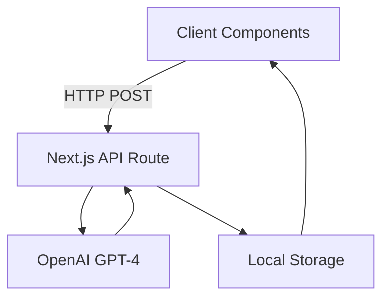

# Talk to Your Future Self


> Hey again, I'm half-asleep. Good luck debugging!

## 🚀 Quick Start

1. **Clone and Navigate**
   ```bash
   git clone https://github.com/yourusername/TTYSF.git
   cd TTYSF
   ```

2. **Set Environment Variables**
   Create a `.env.local` file:
   ```
   OPENAI_API_KEY=sk-your-key
   ```

3. **Install Dependencies**
   ```bash
   npm install
   ```

4. **Run Development Server**
   ```bash
   npm run dev
   ```

## 🔑 OpenAI API Setup

1. [Create API Key](https://platform.openai.com/api-keys)
2. Add to `.env.local`:
   ```
   OPENAI_API_KEY=sk-abc123...paste_key_here
   ```

## 📋 Available Commands

- `npm run dev`: Start development server
- `npm run build`: Create production build
- `npm run start`: Run production server
- `npm run lint`: Run linter

## 🚀 Deployment

[](https://vercel.com/new/clone?repository-url=https%3A%2F%2Fgithub.com%2Fyourusername%2FTTYSF)

## 🛠 Tech Stack

- Next.js
- OpenAI GPT-4o-mini
- tailwindcss

## 🧠 System Architecture




## ⚠️ Warning

No worries! 