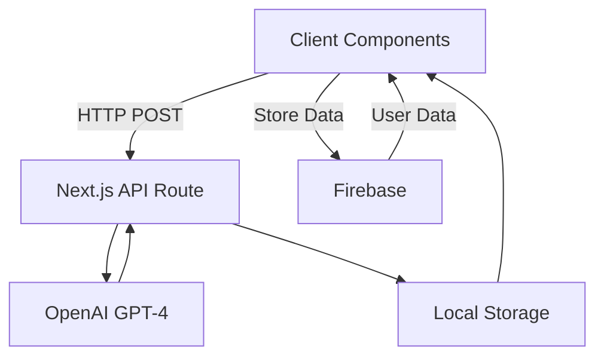

# Project Name


> Hey again, i'm half-asleep, good luck debugging! 

## 🚀 Quick Start

1. **Clone and Navigate**
   ```bash
   git clone https://github.com/yourusername/project-name.git
   cd project-name
   ```

2. **Set Environment Variables**
   Create a `.env.local` file:
   ```
   NEXT_PUBLIC_FIREBASE_API_KEY=your_key
   NEXT_PUBLIC_FIREBASE_AUTH_DOMAIN=your_domain
   NEXT_PUBLIC_FIREBASE_PROJECT_ID=your_id
   NEXT_PUBLIC_FIREBASE_STORAGE_BUCKET=your_bucket
   OPENAI_API_KEY=sk-your-key
   ```

3. **Install Dependencies**
   ```bash
   npm install
   ```

4. **Run Development Server**
   ```bash
   npm run dev
   ```

## 🔧 Firebase Setup

1. Create a Firebase project
2. Enable Authentication (Email link sign-in)
3. Create Firestore Database
4. Add web app configuration to `.env.local`

## 🔑 OpenAI API Setup

1. [Create API Key](https://platform.openai.com/api-keys)
2. Add to `.env.local`:
   ```
   OPENAI_API_KEY=sk-abc123...paste_key_here
   ```

## 📋 Available Commands

- `npm run dev`: Start development server
- `npm run build`: Create production build
- `npm run start`: Run production server
- `npm run lint`: Run linter

## 🚀 Deployment

[](https://vercel.com/new/clone?repository-url=https%3A%2F%2Fgithub.com%2Fyourusername%2Fproject-name)

## 🛠 Tech Stack

- Next.js
- Firebase (Auth/Firestore)
- OpenAI GPT-4
- Chakra UI

## 🧠 System Architecture



## 🔄 Core Workflow

1. User interacts with UI components
2. Data stored in LocalStorage
3. API requests sent to Next.js endpoints
4. OpenAI processes requests
5. Responses update UI and Firebase

## 🔒 Security Notes

- Protect API keys
- Implement rate limiting
- Validate user input

## ⚠️ Warning

No worries